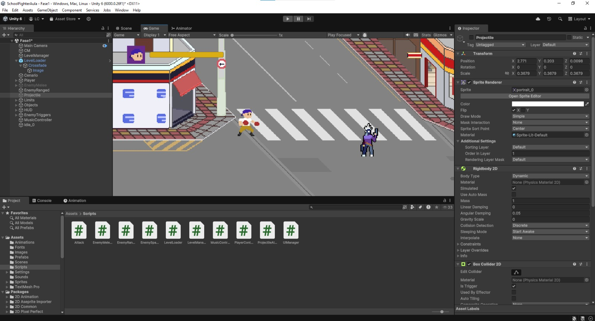
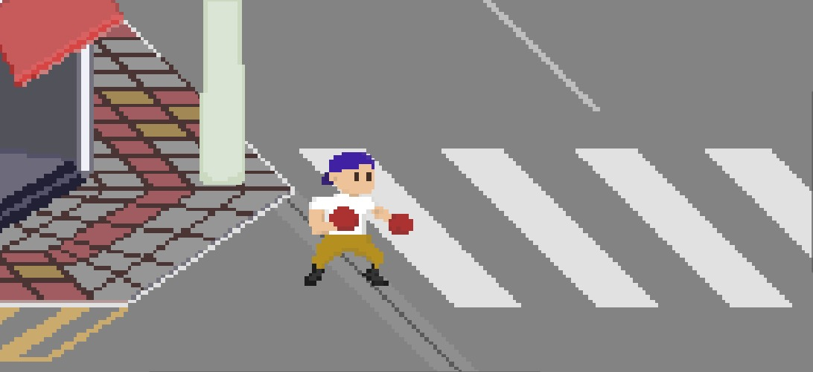
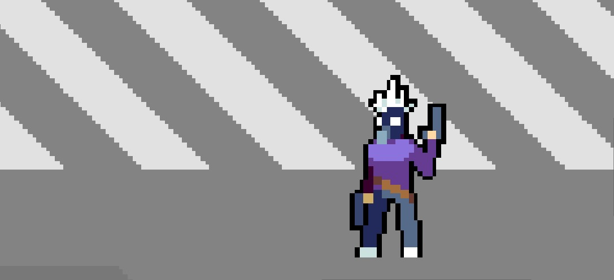

# 🥊 School Fighter - Unity 2D Game

### Esse projeto é apenas uma demo de um jogo Beat'em up, apenas para testar os nossos conhecimentos e experimentar os primeiros passos com a Unity.

🎮 Projeto de jogo 2D no estilo *beat 'em up*, desenvolvido com Unity e C# durante o curso técnico do SENAI.

<div></div>

## 📌 Sobre o Projeto | About the Project

Este jogo foi desenvolvido com o apoio dos professores **Thiago Nascimento** e **Felipe Tadeu**, no SENAI.  
Utilizamos animações e ilustrações 2D feitas especialmente para o jogo, trazendo uma estética escolar divertida e combates no estilo clássico *beat 'em up*.

---
### This Game it's just a demo for studying and developing with Unity!

This game was developed with support from professors **Thiago Nascimento** and **Felipe Tadeu** at SENAI.  
We used custom-made 2D animations and illustrations to create a fun school-themed visual and classic *beat 'em up* combat.

<div></div>

## 🛠️ Tecnologias | Technologies

- Unity Engine 🎮  
- C# 💻  
- 2D Animations ✏️  
- Git & GitHub  

## 🎮 Estilo de Jogo | Game Style

- Combate corpo a corpo com múltiplos inimigos  
- Estilo *beat 'em up* com progressão de fases  
- Visual e temática escolar

---

- Hand-to-hand combat with multiple enemies  
- Classic *beat 'em up* progression  
- School-themed art style

## 🚀 Como Jogar | How to Play

### Português:
```
# Clone o repositório
git clone https://github.com/leticiamaca/SchoolFighter-UnityGame

# Abra o projeto no Unity (versão 2021.x ou superior)
# Clique em Play para iniciar o jogo
```

### English:
```
# Clone the repository
git clone https://github.com/leticiamaca/SchoolFighter-UnityGame

# Open the project in Unity (version 2021.x or higher)
# Click Play to start the game
```

<div></div>

## 📚 Aprendizados | What I Learned

- Organização de cenas e hierarquias no Unity  
- Animações 2D com sprites  
- Programação de lógica de combate em C#  
- Colaboração com equipe e professores  
- Controle de versão com Git

---

- Scene and hierarchy organization in Unity  
- 2D sprite animation  
- Combat logic scripting in C#  
- Team collaboration and instructor support  
- Version control using Git

## 👩‍💻 Desenvolvido por | Developed by

**Letícia de Castro Jacob Marques**  
[GitHub Profile](https://github.com/leticiamaca)

Com apoio dos professores **Thiago Nascimento** e **Felipe Tadeu** – SENAI
